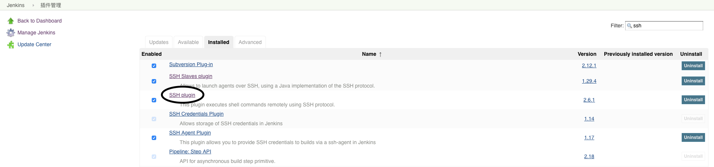
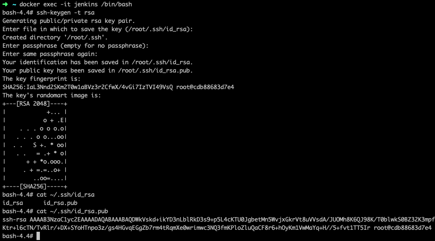
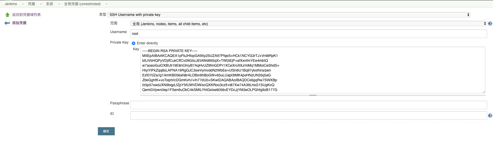
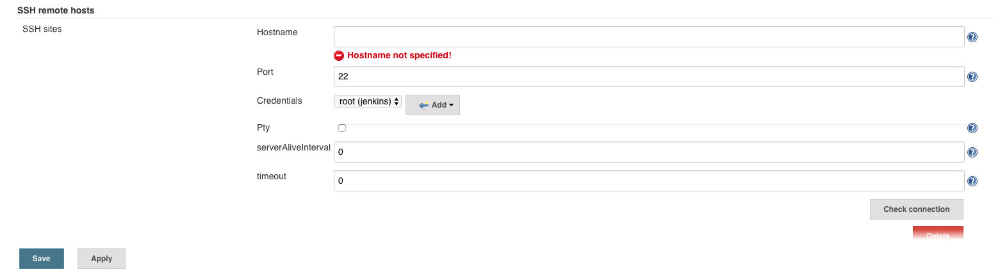
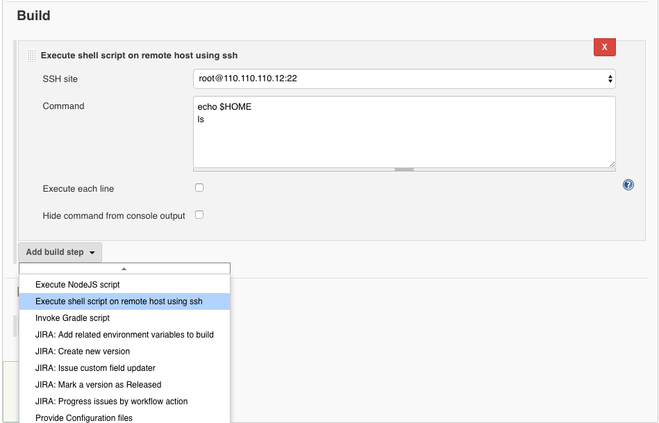

最近迁移服务，并试用了阿里的[CodePipeline](https://www.aliyun.com/product/codepipeline)持续集成服务，发现还是不如自己搭建Jenkins定制化部署好，本文主要介绍如何通过Docker快速搭建Jenkins服务，并利用[SSH+Plugin](https://wiki.jenkins.io/display/JENKINS/SSH+plugin)实现远程部署

**所需环境**

* 系统：CentOS 7
* 两台服务器（其中一台需要装有Docker环境，以便部署Jenkins）

###Step 1: 部署Jenkins

登录ECS1，使用Docker进行部署，并暴露8080端口以便外部访问：

```
docker run \
  -d \
  -u root \
  -p 8080:8080 \
  -v jenkins-data:/var/jenkins_home \
  -v /var/run/docker.sock:/var/run/docker.sock \
  --name jenkins \
  jenkinsci/blueocean
```

由于大部分云服务默认会禁掉非常用端口，可以简单配置域名，通过nginx代理访问：

```
server {
    listen    80;
    server_name    jenkins.youdomain.com;

    location / {
        proxy_pass http://localhost:8080;
    }
}
```

至此Jenkins已经在ECS1上部署好，可通过刚配置的域名进行访问，默认初始密码可通过 `docker logs -f jenkins` 日志获得

###Step 2: 安装SSH插件

启动Jenkins后，可通过系统管理/插件管理进行SSH的插件安装



###Step 3: 生成Jenkins SSH密钥对

由于我们的Jenkins是通过Docker进行部署，你可以把它看成一台具有独立环境的虚拟机，这样可以在容器环境里配置SSH密钥对，让Jenkins通过公网IP与宿主机ECS1或远程机ECS2进行SSH连接，这里我们通过直接修改容器的方式进行生成密钥：



进入ECS1终端，执行：
```
docker exec -it jenkins /bin/bash
```
进入容器环境，生成密钥对：
```
ssh-keygen -t rsa
```

###Step 4: ECS允许Jenkins通过SSH进行远程连接

复制刚刚在容器环境生产的公钥内容`id_rsa.pub`，写入ECS1和ECS2的`~/.ssh/authorized_keys`文件，并确保两台机器放通22端口允许远程连接

###Step 5: 配置Jenkins远程SSH连接服务

首先通过在容器环境里生产的密钥`id_rsa`生成全局凭据



接着配置SSH remote hosts（系统管理/系统配置），输入ECS的公网IP、端口，还有刚刚创建的凭据，如何配置没错，右下角有个Check connection的按钮点击应该连接成功



###Step 6: 创建Job愉快玩耍

新建一个任务，在Build阶段添加Execute shell script on remote host using ssh，选择你需要远程连接的服务器，输入连接成功后需要执行的命令，大功告成



---
